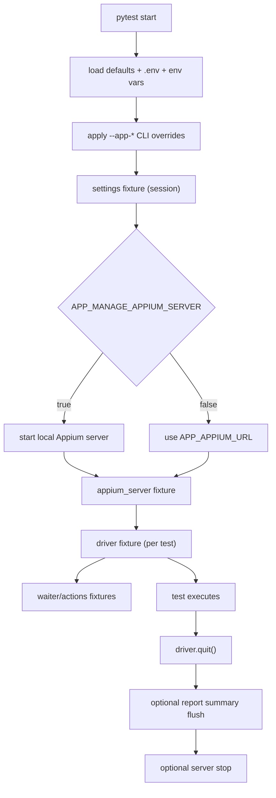

# appium-pytest-kit

`appium-pytest-kit` is a reusable Appium 2.x + pytest framework library for Python 3.11+.

- `pip install appium-pytest-kit` (or install from GitHub — see below)
- `appium-pytest-kit-init` to bootstrap configuration
- Write tests immediately with built-in fixtures and zero boilerplate

**Full documentation:** [DOCUMENTATION.md](./DOCUMENTATION.md)

---

## Installation

### From PyPI (once published)

```bash
pip install appium-pytest-kit
```

### From GitHub

```bash
# latest main branch
pip install git+https://github.com/gianlucasoare/appium-pytest-kit.git

# specific branch
pip install git+https://github.com/gianlucasoare/appium-pytest-kit.git@main

# specific tag
pip install git+https://github.com/gianlucasoare/appium-pytest-kit.git@v0.1.0
```

### Local clone (editable, for development)

```bash
git clone https://github.com/gianlucasoare/appium-pytest-kit.git
cd appium-pytest-kit
pip install -e ".[dev]"
```

---

## Quickstart

```bash
python -m venv .venv
source .venv/bin/activate
pip install git+https://github.com/gianlucasoare/appium-pytest-kit.git
appium-pytest-kit-init        # creates .env with starter config
pytest -q
```

Edit `.env` with your device and app details, then write tests.

---

## Step-by-step: test a real app in 5 minutes

This example tests the Android Calculator on an emulator. See [DOCUMENTATION.md](./DOCUMENTATION.md) for the full iOS walkthrough and all options.

### 1. Start Appium and an emulator

```bash
appium &
emulator -avd Pixel_7_API_33 &
adb devices    # confirm emulator-5554 is listed
```

### 2. Configure `.env`

```env
APP_PLATFORM=android
APP_APPIUM_URL=http://127.0.0.1:4723
APP_DEVICE_NAME=emulator-5554
APP_PLATFORM_VERSION=13
APP_APP_PACKAGE=com.google.android.calculator
APP_APP_ACTIVITY=com.android.calculator2.Calculator
APP_NO_RESET=true
```

### 3. Write a test

```python
# tests/test_calculator.py
import pytest
from appium.webdriver.common.appiumby import AppiumBy

BTN_2      = (AppiumBy.ACCESSIBILITY_ID, "2")
BTN_PLUS   = (AppiumBy.ACCESSIBILITY_ID, "plus")
BTN_3      = (AppiumBy.ACCESSIBILITY_ID, "3")
BTN_EQUALS = (AppiumBy.ACCESSIBILITY_ID, "equals")
RESULT     = (AppiumBy.RESOURCE_ID, "com.google.android.calculator:id/result_final")


@pytest.mark.integration
def test_addition(actions):
    actions.tap(BTN_2)
    actions.tap(BTN_PLUS)
    actions.tap(BTN_3)
    actions.tap(BTN_EQUALS)
    assert actions.text(RESULT) == "5"
```

### 4. Run it

```bash
pytest -m integration -v
```

---

## Built-in fixtures

| Fixture | Scope | Description |
|---|---|---|
| `settings` | session | Resolved `AppiumPytestKitSettings` — access any config field |
| `appium_server` | session | Server URL and whether it is framework-managed |
| `driver` | function | Live `appium.webdriver.Remote`, quit automatically after each test |
| `waiter` | function | Explicit waits with `WaitTimeoutError` on timeout |
| `actions` | function | `tap`, `type_text`, `text`, `exists` — high-level UI helpers |

---

## Configuration

Settings are loaded from `.env` → environment variables → CLI flags (highest wins).

```bash
pytest --app-platform ios
pytest --app-device-name "Pixel 7" --app-platform-version 13
pytest --appium-url http://192.168.1.10:4723
pytest --app-app-package com.example.app --app-app-activity .MainActivity
pytest --app-capabilities-json '{"autoGrantPermissions": true}'
pytest --app-manage-appium-server    # start Appium automatically
pytest --app-reporting-enabled       # write artifacts/appium-pytest-kit/summary.json
```

See [DOCUMENTATION.md § Configuration](./DOCUMENTATION.md#5-configuration) for the full settings table.

---

## Extension hooks

Implement these in your `conftest.py` to customise behaviour without touching the framework:

```python
# conftest.py

def pytest_appium_pytest_kit_capabilities(capabilities, settings):
    """Add extra capabilities before each driver session."""
    return {"autoGrantPermissions": True, "language": "en"}


def pytest_appium_pytest_kit_configure_settings(settings):
    """Replace settings at session start."""
    return settings.model_copy(update={"implicit_wait": 2.0})


def pytest_appium_pytest_kit_driver_created(driver, settings):
    """Run setup immediately after each driver is created."""
    driver.orientation = "PORTRAIT"
```

---

## Public API vs internals

Top-level imports (stable):

```python
from appium_pytest_kit import (
    AppiumPytestKitSettings,
    AppiumPytestKitError,
    ConfigurationError,
    WaitTimeoutError,
    ActionError,
    DriverCreationError,
    DriverConfig,
    MobileActions,
    Waiter,
    build_driver_config,
    create_driver,
    load_settings,
    apply_cli_overrides,
)
```

Stable public modules (direct import):
- `appium_pytest_kit.settings`
- `appium_pytest_kit.driver`
- `appium_pytest_kit.waits`
- `appium_pytest_kit.actions`
- `appium_pytest_kit.errors`
- `appium_pytest_kit.interfaces` — `CapabilitiesAdapter` protocol for custom adapters

Private/internal modules (no compatibility guarantee):
- `appium_pytest_kit._internal.*`

---

## Fixture lifecycle



---

## Local development

```bash
pip install -e ".[dev]"
ruff check .
pytest -q
pytest --collect-only examples/basic/tests -q
```

---

## V2 roadmap hooks (not implemented in v1)

- richer reporting adapters (Allure, JUnit augmentation)
- pluggable driver pool/session reuse strategies
- packaged platform adapter registry
- optional page-object scaffolding generator
