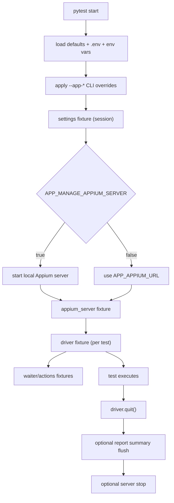

# mobilkit

`mobilkit` is a reusable Appium 2.x + pytest framework library for Python 3.11+.

Goals:
- `pip install mobilkit`
- `mobilkit-init` to bootstrap configuration
- write tests immediately with built-in fixtures and zero boilerplate setup

## Quickstart

```bash
python -m venv .venv
source .venv/bin/activate
pip install mobilkit
mobilkit-init
pytest -q
```

Minimal test:

```python
# test_smoke.py
def test_settings_fixture_is_available(settings):
    assert settings.platform in {"android", "ios"}
```

Integration test with Appium driver fixture:

```python
import pytest

@pytest.mark.integration
def test_session(driver):
    assert driver.session_id is not None
```

## Built-in fixtures

- `settings`: resolved `MobilkitSettings` object
- `appium_server`: resolved server descriptor (`url`, `managed`) with optional lifecycle management
- `driver`: function-scoped Appium driver
- `waiter`: reusable explicit wait utility
- `actions`: reusable generic action helper

## Configuration model

`mobilkit` uses `pydantic-settings` with `APP_` prefix.

Precedence (low -> high):
1. Defaults in `MobilkitSettings`
2. `.env` / environment variables
3. pytest CLI overrides (`--app-*` / `--app-override KEY=VALUE`)

### Common settings

| `.env` key | Type | Default | CLI override |
|---|---|---|---|
| `APP_PLATFORM` | `android|ios` | `android` | `--app-platform` |
| `APP_APPIUM_URL` | `str` | `http://127.0.0.1:4723` | `--appium-url` |
| `APP_MANAGE_APPIUM_SERVER` | `bool` | `false` | `--app-manage-appium-server` |
| `APP_DEVICE_NAME` | `str?` | `None` | `--app-device-name` |
| `APP_PLATFORM_VERSION` | `str?` | `None` | `--app-platform-version` |
| `APP_UDID` | `str?` | `None` | `--app-udid` |
| `APP_APP` | `str?` | `None` | `--app-app` |
| `APP_APP_PACKAGE` | `str?` | `None` | `--app-app-package` |
| `APP_APP_ACTIVITY` | `str?` | `None` | `--app-app-activity` |
| `APP_BUNDLE_ID` | `str?` | `None` | `--app-bundle-id` |
| `APP_CAPABILITIES_JSON` | JSON object | `{}` | `--app-capabilities-json` |
| `APP_REPORTING_ENABLED` | `bool` | `false` | `--app-reporting-enabled` |

### Starter `.env`

Create with:

```bash
mobilkit-init
```

## Extension guide

`mobilkit` is intentionally small and generic. Extend it from your project/plugin:

### 1) Custom fixtures

Define project fixtures in your own `conftest.py` and compose with `driver`, `waiter`, or `actions`.

### 2) Capability customization

Implement custom hook:

```python
def pytest_mobilkit_capabilities(capabilities, settings):
    return {"locale": "en_US"}
```

### 3) Settings customization

Implement hook:

```python
def pytest_mobilkit_configure_settings(settings):
    return settings.model_copy(update={"implicit_wait": 2.0})
```

### 4) Driver lifecycle observation

Implement hook:

```python
def pytest_mobilkit_driver_created(driver, settings):
    driver.orientation = "PORTRAIT"
```

### 5) Custom waits/actions

Compose your own wrappers around `Waiter` and `MobileActions` instead of inheriting framework internals.

### 6) Platform adapters

Use `CapabilitiesAdapter` implementations and pass them into `build_driver_config(...)` in custom factories.

## Public API vs internals

Stable public modules:
- `mobilkit.settings`
- `mobilkit.driver`
- `mobilkit.waits`
- `mobilkit.actions`
- `mobilkit.errors`
- `mobilkit.interfaces`

Private/internal modules (no compatibility guarantee):
- `mobilkit._internal.*`

## Fixture lifecycle



## Example project

See `/Users/gianlucasoare/mobilkit/examples/basic` for a minimal first test and integration test sample.

## Local development

```bash
pip install -e ".[dev]"
ruff check .
pytest -q
pytest --collect-only examples/basic/tests -q
```

## V2 roadmap hooks (not implemented in v1)

- richer reporting adapters (Allure, JUnit augmentation)
- pluggable driver pool/session reuse strategies
- packaged platform adapter registry
- optional page-object scaffolding generator
