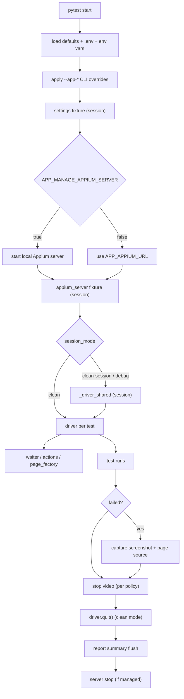

# appium-pytest-kit

[](https://buymeacoffee.com/gianlucasoare)

`appium-pytest-kit` is a reusable Appium 2.x + pytest plugin library for Python 3.11+. Install it once, generate a `.env`, and start writing mobile tests with zero boilerplate.

```bash
pip install appium-pytest-kit
appium-pytest-kit-init --framework --root my-project
```

**Full documentation:** [DOCUMENTATION.md](./DOCUMENTATION.md) · [docs/](./docs/)

---

## What it gives you

| | |
|---|---|
| **Zero-config fixtures** | `driver`, `waiter`, `actions`, `page_factory` — just add to your test function |
| **Auto failure artifacts** | Screenshot + page source captured automatically on every failure |
| **3-tier device resolution** | explicit settings → named profile → auto-detect via adb/xcrun |
| **Session modes** | `clean` (per-test) · `clean-session` (shared) · `debug` (keep alive) |
| **Explicit waits** | `WaitTimeoutError` with structured `.locator` and `.timeout` context |
| **High-level actions** | tap, type, swipe, scroll, assertions — all wait-safe |
| **Extension hooks** | Override settings, inject capabilities, run code after driver creation |
| **CLI scaffold** | One command to generate a full project structure |

---

## Dependencies

All required dependencies are **installed automatically** with `pip install appium-pytest-kit`. You do not need a separate `requirements.txt`.

| Auto-installed | Version | Purpose |
|---|---|---|
| `Appium-Python-Client` | ≥ 4.0.0 | Appium WebDriver client |
| `pydantic-settings` | ≥ 2.3.0 | `.env` and env var loading |
| `pytest` | ≥ 8.2.0 | Test runner integration |

**Optional extras** (install only what you need):

```bash
pip install "appium-pytest-kit[yaml]"    # device profile YAML support
pip install "appium-pytest-kit[allure]"  # Allure report attachments
pip install "appium-pytest-kit[all]"     # all optional extras
```

| Extra | Installs | When you need it |
|---|---|---|
| `[yaml]` | PyYAML ≥ 6.0 | Named device profiles in `data/devices.yaml` |
| `[allure]` | allure-pytest ≥ 2.13.0 | Screenshots + page source in Allure reports |

---

## Installation

### From PyPI

```bash
pip install appium-pytest-kit
```

### From GitHub

```bash
pip install git+https://github.com/gianlucasoare/appium-pytest-kit.git
```

### Local clone (development)

```bash
git clone https://github.com/gianlucasoare/appium-pytest-kit.git
cd appium-pytest-kit
pip install -e ".[dev]"
```

---

## Quickstart: test an app in 5 minutes

### 1 — Scaffold the project

```bash
pip install appium-pytest-kit
appium-pytest-kit-init --framework --root my-project
cd my-project
```

### 2 — Edit `.env` with your device and app

```env
APP_PLATFORM=android
APP_APPIUM_URL=http://127.0.0.1:4723
APP_APP_PACKAGE=com.example.myapp
APP_APP_ACTIVITY=.MainActivity
APP_DEVICE_NAME=emulator-5554
APP_PLATFORM_VERSION=14
```

### 3 — Start Appium and your emulator, then run

```bash
appium &
pytest tests/android/test_smoke.py -v
```

### 4 — Write a real test

```python
# tests/android/test_login.py
import pytest
from appium.webdriver.common.appiumby import AppiumBy

USERNAME = (AppiumBy.ID, "com.example.app:id/username")
PASSWORD = (AppiumBy.ID, "com.example.app:id/password")
LOGIN_BTN = (AppiumBy.ACCESSIBILITY_ID, "login_button")
WELCOME = (AppiumBy.ID, "com.example.app:id/welcome_text")


@pytest.mark.integration
def test_login(actions):
    actions.type_text(USERNAME, "testuser")
    actions.type_text(PASSWORD, "secret")
    actions.tap(LOGIN_BTN)
    assert actions.text(WELCOME) == "Welcome, testuser"
```

```bash
pytest -m integration -v
```

---

## Built-in fixtures

| Fixture | Scope | Description |
|---|---|---|
| `settings` | session | Resolved `AppiumPytestKitSettings` |
| `device_info` | session | Resolved device (name, UDID, version) |
| `appium_server` | session | Server URL, optional lifecycle management |
| `driver` | function | Live `appium.webdriver.Remote`, auto-quit |
| `waiter` | function | Explicit waits with `WaitTimeoutError` |
| `actions` | function | High-level UI helpers |
| `page_factory` | function | Factory for page objects: `page_factory(LoginPage)` |

---

## Page objects with `page_factory`

```python
# pages/login_page.py
from appium.webdriver.common.appiumby import AppiumBy
from appium_pytest_kit import Locator
from pages.base_page import BasePage

class LoginPage(BasePage):
    _USERNAME: Locator = (AppiumBy.ID, "com.example.app:id/username")
    _LOGIN_BTN: Locator = (AppiumBy.ACCESSIBILITY_ID, "login_button")

    def log_in(self, username: str, password: str) -> None:
        self._actions.type_text(self._USERNAME, username)
        self._actions.tap(self._LOGIN_BTN)

    def is_loaded(self) -> bool:
        return self._actions.is_displayed(self._USERNAME)
```

```python
# tests/test_login.py
def test_login_success(page_factory):
    login = page_factory(LoginPage)
    login.wait_until_loaded()
    login.log_in("testuser", "secret")
    # ...
```

See [docs/page-objects.md](docs/page-objects.md) for the full guide.

---

## Session modes

```env
APP_SESSION_MODE=clean          # fresh driver per test (default)
APP_SESSION_MODE=clean-session  # one shared driver for the whole run (faster)
APP_SESSION_MODE=debug          # shared + keep alive on failure (local debugging)
```

---

## Device resolution (3-tier)

1. **Explicit** — `APP_DEVICE_NAME` / `APP_UDID` in `.env` or CLI
2. **Profile** — `APP_DEVICE_PROFILE=pixel7` from `data/devices.yaml`
3. **Auto-detect** — `adb devices` (Android) or `xcrun simctl` / `xctrace` (iOS)

```bash
pytest --app-device-profile pixel7
pytest --app-udid emulator-5554
pytest   # auto-detect if nothing set
```

---

## Failure diagnostics

On test failure the framework automatically captures:
- **Screenshot** → `artifacts/screenshots/<test_id>.png`
- **Page source** → `artifacts/pagesource/<test_id>.xml`
- **Video** (if configured) → `artifacts/videos/<test_id>.mp4`

```env
APP_VIDEO_POLICY=failed   # record and save only on failure
APP_VIDEO_POLICY=always   # record every test
```

Allure attachments are added automatically when `allure-pytest` is installed.

---

## Configuration

Settings load from `.env` → env vars → CLI flags (highest wins).

```bash
pytest --app-platform ios
pytest --app-device-name "Pixel 7" --app-platform-version 14
pytest --appium-url http://192.168.1.10:4723
pytest --app-session-mode clean-session
pytest --app-device-profile pixel7
pytest --app-video-policy failed
pytest --app-explicit-wait-timeout 15
pytest --app-capabilities-json '{"autoGrantPermissions": true}'
pytest --app-manage-appium-server
pytest --app-reporting-enabled
```

See [docs/configuration.md](docs/configuration.md) for all settings.

---

## Extension hooks

```python
# conftest.py

def pytest_appium_pytest_kit_capabilities(capabilities, settings):
    """Add extra capabilities before each driver session."""
    if settings.platform == "android":
        return {"autoGrantPermissions": True, "language": "en"}

def pytest_appium_pytest_kit_configure_settings(settings):
    """Replace settings at session start."""
    return settings.model_copy(update={"explicit_wait_timeout": 20.0})

def pytest_appium_pytest_kit_driver_created(driver, settings):
    """Run setup immediately after each driver is created."""
    driver.orientation = "PORTRAIT"
```

---

## Expanded waits

```python
waiter.for_clickable(locator)
waiter.for_invisibility(locator)
waiter.for_text_contains(locator, "partial text")
waiter.for_text_equals(locator, "exact text")
waiter.for_all_visible([loc1, loc2, loc3])   # single timeout for the whole group
waiter.for_all_gone([loc1, loc2])
waiter.for_any_visible([loc1, loc2])
waiter.for_context_contains("WEBVIEW")
waiter.for_android_activity("MainActivity")
```

---

## Expanded actions

```python
# Tap
actions.tap_if_present(locator)
actions.tap_if_present_first_available([l1, l2])
actions.tap_by_coordinates(x, y)
actions.double_tap(locator)
actions.long_press(locator, duration_seconds=2)

# Text
actions.type_if_present(locator, "text")
actions.type_text_slowly(locator, "otp", delay_per_char=0.15)
actions.clear(locator)

# Assertions
actions.is_displayed(locator)
actions.assert_displayed(locator)
actions.assert_not_displayed_first_available([l1, l2])

# Scroll
actions.scroll_down()
actions.scroll_to_element(locator)

# Keyboard
actions.hide_keyboard()
actions.press_keycode(66)  # ENTER

# Hybrid
actions.switch_to_webview()
actions.switch_to_native()
```

---

## Public API

```python
from appium_pytest_kit import (
    AppiumPytestKitSettings,
    AppiumPytestKitError,
    ConfigurationError, DeviceResolutionError, LaunchValidationError,
    WaitTimeoutError, ActionError, DriverCreationError,
    DeviceInfo, DriverConfig, MobileActions, Waiter,
    Locator,           # type alias: tuple[str, str]
    build_driver_config, create_driver, load_settings, apply_cli_overrides,
)
```

---

## Fixture lifecycle



---

## Local development

```bash
pip install -e ".[dev]"
python -m ruff check .
python -m pytest -q
python -m pytest --collect-only examples/basic/tests -q
```

---

## Documentation

| Topic | File |
|---|---|
| Installation + dependencies | [docs/installation.md](docs/installation.md) |
| Project structure + scaffold | [docs/project-structure.md](docs/project-structure.md) |
| Configuration (all settings) | [docs/configuration.md](docs/configuration.md) |
| Built-in fixtures | [docs/fixtures.md](docs/fixtures.md) |
| Page objects guide | [docs/page-objects.md](docs/page-objects.md) |
| conftest.py guide | [docs/conftest-guide.md](docs/conftest-guide.md) |
| Waits reference | [docs/waits.md](docs/waits.md) |
| Actions reference | [docs/actions.md](docs/actions.md) |
| Session modes | [docs/session-modes.md](docs/session-modes.md) |
| Device resolution | [docs/device-resolution.md](docs/device-resolution.md) |
| Failure diagnostics + video | [docs/diagnostics.md](docs/diagnostics.md) |
| Error reference | [docs/errors.md](docs/errors.md) |
| Troubleshooting | [docs/troubleshooting.md](docs/troubleshooting.md) |
