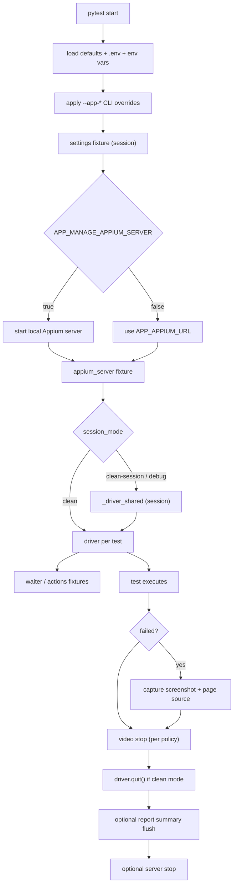

# appium-pytest-kit

[](https://buymeacoffee.com/gianlucasoare)

`appium-pytest-kit` is a reusable Appium 2.x + pytest framework library for Python 3.11+.

- `pip install appium-pytest-kit` (or install from GitHub — see below)
- `appium-pytest-kit-init` to bootstrap configuration, or `--framework` to scaffold a full project
- Write tests immediately with built-in fixtures and zero boilerplate

**Full documentation:** [DOCUMENTATION.md](./DOCUMENTATION.md)

---

## Installation

### From PyPI (once published)

```bash
pip install appium-pytest-kit
```

### From GitHub

```bash
# latest main branch
pip install git+https://github.com/gianlucasoare/appium-pytest-kit.git

# specific branch
pip install git+https://github.com/gianlucasoare/appium-pytest-kit.git@main

# specific tag
pip install git+https://github.com/gianlucasoare/appium-pytest-kit.git@v0.1.0
```

### Local clone (editable, for development)

```bash
git clone https://github.com/gianlucasoare/appium-pytest-kit.git
cd appium-pytest-kit
pip install -e ".[dev]"
```

---

## Quickstart

```bash
python -m venv .venv
source .venv/bin/activate
pip install git+https://github.com/gianlucasoare/appium-pytest-kit.git
appium-pytest-kit-init          # creates .env with starter config
# or scaffold a full project:
appium-pytest-kit-init --framework --root my-project
pytest -q
```

Edit `.env` with your device and app details, then write tests.

---

## Step-by-step: test a real app in 5 minutes

This example tests the Android Calculator on an emulator. See [DOCUMENTATION.md](./DOCUMENTATION.md) for the full iOS walkthrough and all options.

### 1. Start Appium and an emulator

```bash
appium &
emulator -avd Pixel_7_API_33 &
adb devices    # confirm emulator-5554 is listed
```

### 2. Configure `.env`

```env
APP_PLATFORM=android
APP_APPIUM_URL=http://127.0.0.1:4723
APP_DEVICE_NAME=emulator-5554
APP_PLATFORM_VERSION=13
APP_APP_PACKAGE=com.google.android.calculator
APP_APP_ACTIVITY=com.android.calculator2.Calculator
APP_NO_RESET=true
```

### 3. Write a test

```python
# tests/test_calculator.py
import pytest
from appium.webdriver.common.appiumby import AppiumBy

BTN_2      = (AppiumBy.ACCESSIBILITY_ID, "2")
BTN_PLUS   = (AppiumBy.ACCESSIBILITY_ID, "plus")
BTN_3      = (AppiumBy.ACCESSIBILITY_ID, "3")
BTN_EQUALS = (AppiumBy.ACCESSIBILITY_ID, "equals")
RESULT     = (AppiumBy.RESOURCE_ID, "com.google.android.calculator:id/result_final")


@pytest.mark.integration
def test_addition(actions):
    actions.tap(BTN_2)
    actions.tap(BTN_PLUS)
    actions.tap(BTN_3)
    actions.tap(BTN_EQUALS)
    assert actions.text(RESULT) == "5"
```

### 4. Run it

```bash
pytest -m integration -v
```

---

## Built-in fixtures

| Fixture | Scope | Description |
|---|---|---|
| `settings` | session | Resolved `AppiumPytestKitSettings` — access any config field |
| `appium_server` | session | Server URL and whether it is framework-managed |
| `driver` | function | Live `appium.webdriver.Remote`, quit automatically after each test |
| `waiter` | function | Explicit waits with `WaitTimeoutError` on timeout |
| `actions` | function | High-level UI helpers: `tap`, `type_text`, `text`, `exists`, `swipe`, and more |

---

## Session modes

Control driver lifecycle per test or across the whole session:

```env
APP_SESSION_MODE=clean          # default: fresh driver per test
APP_SESSION_MODE=clean-session  # shared driver, app reset between tests
APP_SESSION_MODE=debug          # shared driver, no reset (fast local debugging)
```

---

## Device resolution (3-tier priority)

1. **Explicit** — `APP_DEVICE_NAME` / `APP_UDID` set in `.env` or CLI
2. **Profile** — `APP_DEVICE_PROFILE=pixel7` resolved from `data/devices.yaml`
3. **Auto-detect** — `adb devices` (Android) or `xcrun simctl` / `xctrace` (iOS)

```bash
# Use a named profile from data/devices.yaml
pytest --app-device-profile pixel7

# Auto-detect (no device settings needed)
pytest
```

---

## Failure diagnostics

On test failure the framework automatically captures:
- **Screenshot** → `artifacts/screenshots/<test_id>.png`
- **Page source** → `artifacts/pagesource/<test_id>.xml`
- **Video** (if policy allows) → `artifacts/videos/<test_id>.mp4`

```env
APP_VIDEO_POLICY=never    # default
APP_VIDEO_POLICY=failed   # record and save only on failure
APP_VIDEO_POLICY=always   # record every test
APP_ARTIFACTS_DIR=artifacts
```

Allure attachments are added automatically when `allure-pytest` is installed.

---

## Configuration

Settings are loaded from `.env` → environment variables → CLI flags (highest wins).

```bash
pytest --app-platform ios
pytest --app-device-name "Pixel 7" --app-platform-version 13
pytest --appium-url http://192.168.1.10:4723
pytest --app-app-package com.example.app --app-app-activity .MainActivity
pytest --app-session-mode clean-session
pytest --app-device-profile pixel7
pytest --app-video-policy failed
pytest --app-is-simulator
pytest --app-capabilities-json '{"autoGrantPermissions": true}'
pytest --app-manage-appium-server    # start Appium automatically
pytest --app-reporting-enabled       # write artifacts/appium-pytest-kit/summary.json
```

See [DOCUMENTATION.md § Configuration](./DOCUMENTATION.md#5-configuration) for the full settings table.

---

## Expanded waits

```python
# Element state
waiter.for_clickable(locator)                          # wait for element to be tappable
waiter.for_invisibility(locator)                       # wait for element to disappear

# Text matching
waiter.for_text_contains(locator, "partial text")      # wait for text substring
waiter.for_text_equals(locator, "exact text")          # wait for exact text match

# Collections
waiter.for_all_visible([loc1, loc2, loc3])             # wait for all elements to appear
waiter.for_all_gone([loc1, loc2])                      # wait for all elements to disappear
waiter.for_any_visible([loc1, loc2])                   # wait for first visible element

# Platform / context
waiter.for_context_contains("WEBVIEW")                 # wait for hybrid app webview context
waiter.for_android_activity("MainActivity")            # wait for Android activity
waiter.for_android_toast("Saved successfully")         # wait for Android toast message
```

---

## Expanded actions

```python
# Tap variants
actions.tap_if_present(locator)                  # tap if visible — returns bool
actions.tap_if_present_first_available([l1, l2]) # tap first visible from list — returns bool
actions.tap_by_coordinates(x, y)                 # tap at screen pixel coordinates
actions.tap_center(locator)                      # tap the visual center of element
actions.double_tap(locator)                      # two quick taps
actions.long_press(locator, duration_seconds=2)  # hold press

# Text input
actions.type_if_present(locator, "text")                  # type if visible — returns bool
actions.type_if_present_first_available([l1, l2], "text") # type into first visible — returns bool
actions.type_first_available([l1, l2], "text")            # type into first visible (raises on fail)
actions.type_text_slowly(locator, "text", delay_per_char=0.1)  # char-by-char typing
actions.clear(locator)                                     # clear a text field

# Read
actions.attribute(locator, "content-desc")               # read element attribute

# Scroll / swipe
actions.swipe(sx, sy, ex, ey)                            # raw W3C swipe gesture
actions.scroll_down()                                     # swipe up on screen center
actions.scroll_up()                                       # swipe down on screen center
actions.scroll_to_element(locator)                        # scroll until element visible

# Keyboard
actions.hide_keyboard()                                   # dismiss soft keyboard
actions.press_keycode(66)                                 # Android keycode (66=ENTER, 4=BACK)

# Hybrid / WebView
actions.is_webview_available()                            # bool — WEBVIEW context exists
actions.switch_to_webview()                               # switch to WEBVIEW context
actions.switch_to_native()                                # switch back to NATIVE_APP
```

---

## Extension hooks

Implement these in your `conftest.py` to customise behaviour without touching the framework:

```python
# conftest.py

def pytest_appium_pytest_kit_capabilities(capabilities, settings):
    """Add extra capabilities before each driver session."""
    return {"autoGrantPermissions": True, "language": "en"}


def pytest_appium_pytest_kit_configure_settings(settings):
    """Replace settings at session start."""
    return settings.model_copy(update={"implicit_wait": 2.0})


def pytest_appium_pytest_kit_driver_created(driver, settings):
    """Run setup immediately after each driver is created."""
    driver.orientation = "PORTRAIT"
```

---

## Project scaffolding

Generate a full project structure in one command:

```bash
appium-pytest-kit-init --framework --root my-project
```

Creates:
```
my-project/
├── data/devices.yaml          # device profiles
├── pages/
│   ├── base_page.py           # BasePage composition class
│   └── example_page.py        # starter page object
├── flows/                     # reusable multi-step flows
├── tests/
│   ├── android/test_smoke.py
│   └── ios/test_smoke.py
├── conftest.py
├── pytest.ini
└── .env.example
```

---

## Public API

Top-level imports (stable):

```python
from appium_pytest_kit import (
    AppiumPytestKitSettings,
    AppiumPytestKitError,
    ConfigurationError,
    DeviceResolutionError,
    LaunchValidationError,
    WaitTimeoutError,
    ActionError,
    DriverCreationError,
    DeviceInfo,
    DriverConfig,
    MobileActions,
    Waiter,
    build_driver_config,
    create_driver,
    load_settings,
    apply_cli_overrides,
)
```

Stable public modules (direct import):
- `appium_pytest_kit.settings`
- `appium_pytest_kit.driver`
- `appium_pytest_kit.waits`
- `appium_pytest_kit.actions`
- `appium_pytest_kit.errors`
- `appium_pytest_kit.interfaces` — `CapabilitiesAdapter` protocol for custom adapters

Private/internal modules (no compatibility guarantee):
- `appium_pytest_kit._internal.*`

---

## Fixture lifecycle



---

## Local development

```bash
pip install -e ".[dev]"
ruff check .
pytest -q
pytest --collect-only examples/basic/tests -q
```
